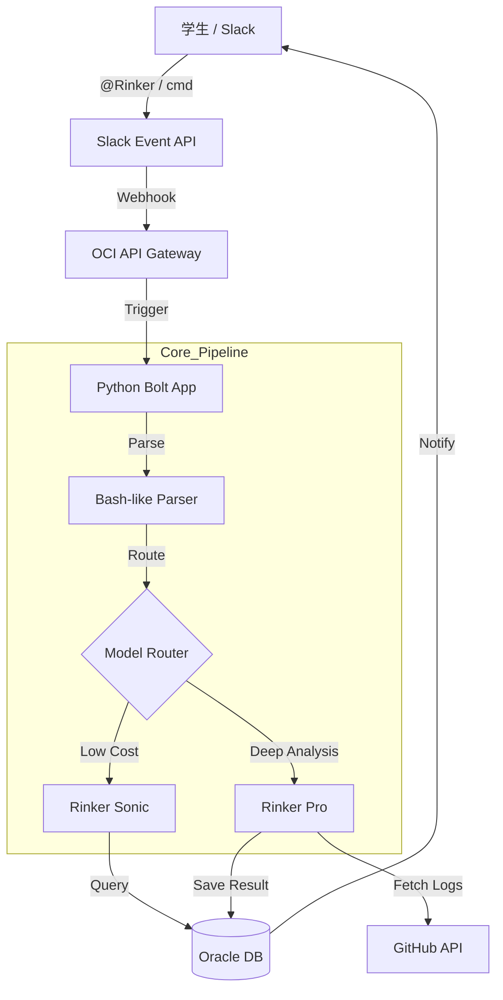

# Rinker by Rikolink

> **「エンジニアの試行錯誤を、市場価値へ同期する。」**

Rinker（リンカー）は、理工系学生の日常的な活動（GitHub, Slack, Notion）を捕捉し、企業評価に直結する独自の「TechLeader Score」へと変換・同期するBashライクなAIアシスタントである。

---

## 1. コンセプト
Rinkerは、エンジニアが使い慣れたターミナルの操作感をSlack上で再現します。冗長な対話ではなく、フラグ（オプション）を用いた効率的なコマンド操作を基本とする

* **インターフェース**: Slack メンションキーワード (`@Rinker /command`)
* **設計思想**: 
    - 試行錯誤（Tinker）を価値に変える。
    - ターミナルのような等幅フォント形式によるレスポンス。
    - 複雑なプロンプトを不要にするフラグベースの指示。

---

## 2. コマンド呼び出し
スラッシュコマンドおよびメンションを通じて、以下のBashライクなコマンドを実行可能

### Evaluation (解析・評価)
| コマンド | オプション | 内容 | 駆動AIモデル |
| :--- | :--- | :--- | :--- |
| **`sum`** | `-w`, `--week` | 週間進捗要約の生成。企業提出用の下書きを作成。 | **Pro** |
| | `-d`, `--day` | 本日の日報要約の生成。 | **Sonic** |
| **`stat`** | `-v`, `--verbose` | TechLeader Scoreの指標別詳細（TES/PCS等）を表示。 | **Flash** |
| | `-g`, `--graph` | 成長曲線のグラフ表示（Looker Studio連携）。 | **Flash** |

### Scouting (企業連携)
| コマンド | オプション | 内容 | 駆動モデル |
| :--- | :--- | :--- | :--- |
| **`push`** | `-f`, `--force` | 現在の要約を企業ポータルへ即時送信（Shout）。 | **Pro** |
| | `--draft` | 企業送信用の下書きを保存・確認。 | **Pro** |

### Scheduling (RinkerBell)
| コマンド | オプション | 内容 | 駆動モデル |
| :--- | :--- | :--- | :--- |
| **`bell`** | `-ls`, `--list` | 予約可能な面談スロットを一覧表示。 | **Flash** |
| | `-n`, `--now` | 「今すぐ面談可能」ステータスへの切り替え。 | **Flash** |

---

## 3. Gemini API
リクエストの緊急度と計算負荷に応じて、Geminiモデルを自動ルーティング

* **Rinker Sonic (Gemini 2.5 Flash)**
    * **役割**: 低レイテンシ応答、簡易QA、スコア照会、日程確認。
* **Rinker Pro (Gemini 2.5 Pro)**
    * **役割**: 高精度解析、GitHub/Slackの文脈理解、企業向け要約生成。

---

## 4. 評価軸
学生の活動は、以下の数式に基づきリアルタイムおよび定時バッチで算出

$$TechLeader Score = 0.4 \times TES + 0.3 \times PCS + 0.2 \times TCS + 0.1 \times TGS$$

* **TES (Technical Execution Score)**: GitHubのコミット、PR、コード複雑度。
* **PCS (Project Completion Score)**: マイルストーン達成率、納期遵守。
* **TCS (Team Contribution Score)**: Slackでのレビュー参加、技術共有、応答速度。
* **TGS (Technical Growth Score)**: 技術習得速度、対応領域の拡大。

---

## 5. 技術スタック
コスト最適化と理工系コミュニティへの適合を考慮した構成

* **Runtime**: Python 3.11+
* **Framework**: Slack Bolt SDK
* **AI API**: Gemini 1.5 Flash / Pro (Google AI SDK)
* **Cloud**: Oracle Cloud Infrastructure (OCI)
    * **Compute**: OCI Compute (Ampere A1)
    * **Database**: Oracle Autonomous Database (ADW/JSON)
    * **Gateway**: OCI API Gateway
* **Visual**: Google Looker Studio (埋め込み表示)

---

## 6. アーキテクチャ
Slackerのパイプライン設計 をベースに、Bashパーサーを統合



## 7. ディレクトリ構造

```text
/
├── README.md           # 本ドキュメント
├── .env.example        # 設定テンプレート (OCI/Slack/Gemini)
├── src/
│   ├── app.py          # エントリーポイント
│   ├── parser/         # Bash-like コマンド解析 (argparse拡張)
│   ├── listeners/      # Slackイベント・コマンド処理
│   ├── engines/        # Gemini API 連携 (Sonic/Pro)
│   ├── services/       # Oracle DB / GitHub / RinkerBell アクセス層
│   └── common/         # 共通モデル定義 (SlackMessage/FeedbackResponse)
├── tests/              # ユニットテスト
└── scripts/            # OCI デプロイメント・スクリプト
```

## 8. 使用設計
ユーザー（学生）が Rinker を使い始めるための最短フロー

### 1. Account Linking
まず、自身の GitHub アカウントを Rinker に紐付けます。これにより、リポジトリの活動がスコア計算の対象となります。
```bash
@Rinker /link --github <your-github-id>

# 今日の活動をクイックに要約 (Sonicモデル)
@Rinker sum -d

# 今週の成果を深く解析し、企業向けの下書きを作成 (Proモデル)
@Rinker sum -w
```
### 2. Daily/Weekly Analysis

```bash
# 今日の活動をクイックに要約 (Sonicモデル)
@Rinker sum -d

# 今週の成果を深く解析し、企業向けの下書きを作成 (Proモデル)
@Rinker sum -w
```

### 3. Status Check

```bash
# 指標別の詳細スコアを表示
@Rinker stat -v
```

### 4. Shout

```bash
@Rinker push --force
```

## 9. 開発環境

開発メンバーがローカル環境を構築する手順です。

### 1. 必須条件
* Python 3.11 以上
* OCI CLI のセットアップと認証構成済みの環境
* Slack App (Bot Token & Signing Secret)

### 2. 環境変数
リポジトリ直下に `.env` を作成し、以下の定数を設定してください。
```text
# Slack API Settings
SLACK_BOT_TOKEN=xoxb-...
SLACK_SIGNING_SECRET=...

# Gemini API Settings
GEMINI_API_KEY=...

# OCI Settings
OCI_CONFIG_PROFILE=DEFAULT
ORACLE_DB_USER=...
ORACLE_DB_PASSWORD=...
ORACLE_DB_DSN=...
```

### 3. インストール
```text
# 依存ライブラリのインストール
pip install -r requirements.txt

# ローカルサーバーの起動 (Port: 3000)
python src/app.py
```

## 10. OCI

本番環境（OCI）へのデプロイに関する指針です。

* **Compute**: Ampere A1 Compute インスタンス上で Docker コンテナとして実行。
* **CI/CD**: GitHub Actions を使用し、OCI Container Registry への Push およびインスタンスへのデプロイを自動化。
* **Database**: Oracle Autonomous JSON Database を使用し、学生の活動ログとスコアをセキュアに永続化。

## 11.ルール

* **Bash-like Experience**: 常に「等幅フォント」と「簡潔な出力」を意識した UI 設計を行う。
* **Data Driven**: 評価（Score）は、自己申告ではなく「GitHub の活動（Fact）」を根拠とする。
* **Security First**: 企業に公開される情報は、学生の `/shout` による明示的な承認を得たもののみとする。

## 12. License

Copyright (c) 2025 RikoLink Project. All rights reserved.
Built by **Kosei Miyamoto**, **Yuji** and **GEM**.


